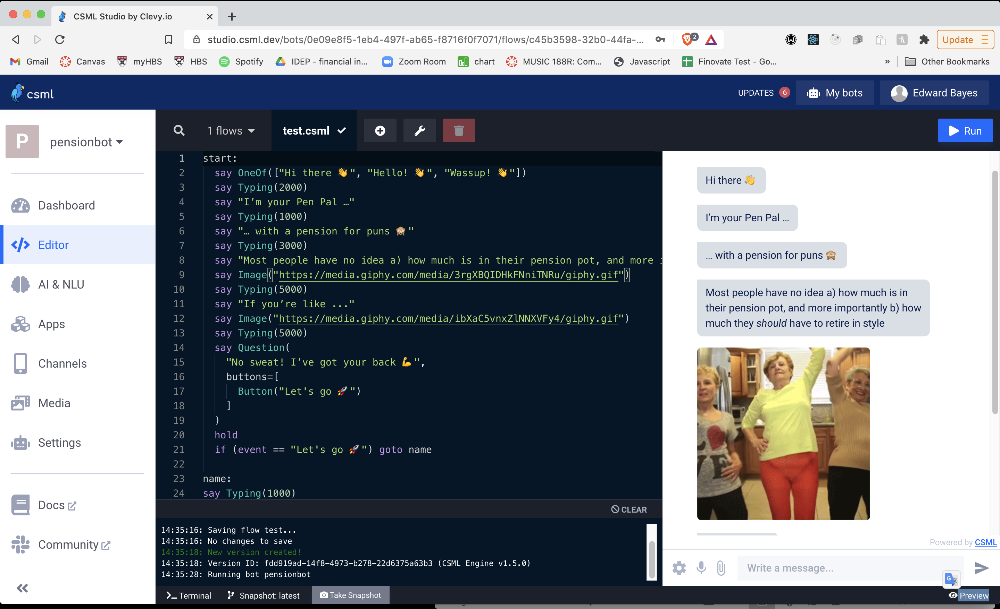

----
# 🔮 PensionPal - the UK's first AI retirement savings prediction model

## Introduction

`pensionpal` is a tool that predicts an individual's future retirement income based on publicly available employment and salary data from LinkedIn and Glassdoor. On the backend it is a python 🐍 package and on the frontend it has a simple chatbot 🤖 interface.

## How PensionPal works

Running `python setup.py install` installs packages, which include:
- ✂️ **`linkedin_scraper.py`** - scrapes users LinkedIn profile and exports to a .csv file
- 🧼 **`data_clean.py`** - cleans .csv file and formats for data analysis
- 🤑 **`glassdoor_scraper.py`** - cross-references employment data from LinkedIn in .csv file and makes adjustments
- 🧮 **`pension_predictor.py`** - calculates size of current pension pots (401ks) based on % of income set out in UK government's auto enrolment legislation and projects values into the future
- 🔮 **`glassdoor_compare.py`** - uses Markov Chains to predict future pension (401k) contributions based on comparable career trajectories on LinkedIn  # work in progress

## A worked example

*The following example contains real data from an anonymised source.*

`linkedin_scraper.py` scrapes profile via the Person() function

```py
from linkedin_scraper import person
person = Person("https://www.linkedin.com/in/anonymous_user/")
print(person)
```

> StartDate | EndDate | Employer | Role
> --- | --- | --- | ---
> Feb 2016 | Present | Technical Support Manager (Executive Officer) | Department for Work and Pensions (DWP)
> Nov 2014 | Feb 2016 | Specialist | Apple

`data_clean.py' uses `numpy` to format the data into a format for analysis via the Clean() function

```py
import numpy as np
cleanPerson = Clean(person)
print(cleanPerson)
```

> StartMonth | StartYear | EndMonth | EndYear | TotalMonths | Employer | Role
> --- | --- | --- | --- | --- | --- | ---
> 2 | 2016 | nan | nan | 62 | Technical Support Manager | Department for Work and Pensions
> 11 | 2014 | 2 | 2016 | 15 | Specialist | Apple

`glassdoor_scraper.py` scrapes profile via the Salary() function and makes adjustments for salary growth and inflation.

```py
from glassdoor_scraper import salary
salary = Salary(cleanPerson)
print(salary)
```

> No | ... | Salary | SalaryAdjusted
> --- | --- | --- | ---
> 0 | ... | 26,350 | 26,350
> 1 | ... | 21,148 | 18,359

`pension_predictor.py` predicts the present value of the user's pension pot via the PredictPast() function, and the future value (at the point of retirement) and retirement income using via the PredictFuture() function

```py
from pension_predictor import past, future
pensionpots = PredictPast(salary)
futurepension = PredictFuture(pensionpots)
print(futurepensions)
```

> No | ... | PotPrediction | PotPredictionEnd | RetirementIncome
> --- | --- | --- | --- | ---
> 0 | ... | 1035.26 | 4235 | 177.70
> 1 | ... | nan | nan | 3677

## 🥊 Comparing predicted vs real projections

Working with real users (n=14), we have been able to validate the model, and early results show a high level of accuracy.

Using the worked example above, real 🆚 predicted outcomes can be compared.

ExamplePredicted | ExampleReal | MedianPredicted | AverageReal
--- | --- | --- | ---
3,855 | 3,222 | 4,604 | 2579

## 🗣 Chatbot

`pensionpal` is integrated with a chatbot interface, built using open source platform CSML.




## 💻 Web hosting

A mock up of frontend and backend integrated together is shown below, with social integration to access user data more efficiently.


